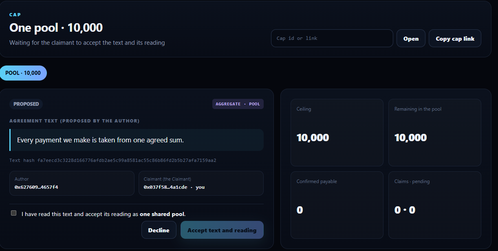
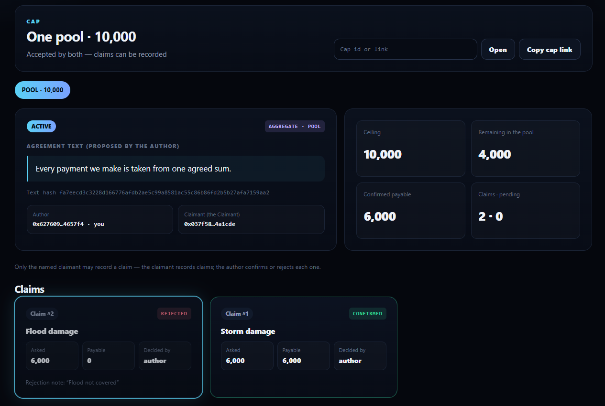

# RUNTIME_EVIDENCE

```
COMPILE PASS ≠ RUNTIME PASS
SUBMITTED ≠ ACCEPTED ≠ FINALIZED ≠ EXECUTION SUCCESS ≠ POSTCONDITION PASS
```

## Project run — CapAccord (address `0x59846a597599BEdcDC43264b20D6BED8658709B0`, through this app)

Run date 2026-10-07, app at https://per-or-total-u6np.vercel.app, MetaMask on StudioNet. Deploy tx [`0xce80e6b4…37fe5fe6`](https://explorer-studio.genlayer.com/tx/0xce80e6b4c4504a5c5ab68e276cea166b9711b32fd8897c8a36b3fcad37fe5fe6). **6 transactions** sent from the app, all FINALIZED with SUCCESS.

Wallets: **author** `0x6276095FAEA15108740445ff277fdA8c304657F4` · **claimant** `0x037f58E33c1Ec8fdA272361E0aAC1e31054a1CDE`.
Cap `94bc2822636420fda3774785ed718180ac215a1c860e7f28eed3beece2d80931`, text hash `fa7eecd3c3228d166776afdb2ae5c99a8581ac55c86b86fd2b5b27afa7159aa2` — https://per-or-total-u6np.vercel.app/?c=94bc2822636420fda3774785ed718180ac215a1c860e7f28eed3beece2d80931.

| # | Wallet | Action in the app | Tx hash | Result (read back by the app from the accepted state) |
|---|---|---|---|---|
| P1 | author | Propose: claimant, label `the Claimant`, ceiling 10000, `Every payment we make is taken from one agreed sum.` | [`0x063739b5…63a54bd6`](https://explorer-studio.genlayer.com/tx/0x063739b560ba0c279ba45c6c019a313aefdead3c6abc0fba1c6b939a63a54bd6) | **AGGREGATE · POOL**, state **PROPOSED** — nothing active yet |
| P2 | claimant | Open the cap before accepting | — (not sent) | only *Accept text and reading* / *Decline*, no claim form; Accept disabled until the read box is ticked (screenshot 1) |
| P3 | claimant | Accept text and reading (signs the text hash) | [`0x5392b71d…63507fff`](https://explorer-studio.genlayer.com/tx/0x5392b71d4f9919ab2a88e0d34506933eb75808eb41901945f913f54e63507fff) | **ACTIVE** — "Accepted by both" |
| P4 | claimant | Record claim 6000 `Storm damage` | [`0x45a1b075…3c9e0a3f`](https://explorer-studio.genlayer.com/tx/0x45a1b0750ab13d2ff292d085a2250dcea4d694f563eea7fa678d9be83c9e0a3f) | claim #1 PENDING, payable 0 — nothing drawn |
| P5 | claimant | Record claim 6000 `Flood damage` | [`0xc37cf71c…9a326c1c`](https://explorer-studio.genlayer.com/tx/0xc37cf71cd74b887fbc3bd25401b70c9bc742b33c3ffbad2610c288399a326c1c) | claim #2 PENDING; confirmed payable still 0 |
| P6 | author | Confirm claim #1 | [`0xf733db03…5eb717c9`](https://explorer-studio.genlayer.com/tx/0xf733db03ded4cca4e041414570cfba05abb5684b3556743183912d325eb717c9) | **CONFIRMED, payable 6,000**; 4,000 remains in the pool |
| P7 | author | Reject claim #2 — `Flood not covered` | [`0x999f5812…22ac4042`](https://explorer-studio.genlayer.com/tx/0x999f581265860c996774eb471efbeec6a3d13064693ee7af3a556e5122ac4042) | **REJECTED, payable 0**, note kept; pool still 4,000, confirmed payable 6,000 (screenshot 2) |

Every payable number on this cap rests on two signatures: the claimant's acceptance of the exact text (by its hash) with
its POOL reading, and the author's confirmation of the claim. The claimant's second claim, refused by the author, drew
nothing. The app reported every write only after re-reading the cap and its claims (`src/lib/verify.ts`).

Screenshots:





## Earlier deployment — CapScope (1.0.0, before the two-party model)

Contract `0x3579A82696B64bAB406341A500e23977172d5a6C`, deploy tx `0x9845285621b651850a900c7806e79487c950c0fac4db7e66bce2602b8e38abcd`.
Author `0x6276095FAEA15108740445ff277fdA8c304657F4`, claimant `0x037f58E33c1Ec8fdA272361E0aAC1e31054a1CDE`, cap
`9778c08b1662991ef14a6da7d4ab8c85c5ff3935f82814298a19da6d5746c952`. The same reading (AGGREGATE · POOL for "Every payment
we make is taken from one agreed sum.") and the same pool arithmetic, but claims counted on the claimant's word alone:


| Step | Asked | Recorded | Resulting remaining | UI result |
|---|---:|---:|---:|---|
| Open aggregate cap | — | — | `10000` | `AGGREGATE · POOL` |
| Claim 1 (`first`) | `6000` | `6000` | `4000` | `FULL` |
| Claim 2 (`second-over-cap`) | `6000` | `4000` | `0` | `CUT` |
| Further claim | `6000` preview | `0` | `0` | Blocked before wallet: `The cap has been used up` |
| Author dispute on claim 2 | — | remains `4000` | remains `0` | `Disputed: Not accepted` |
